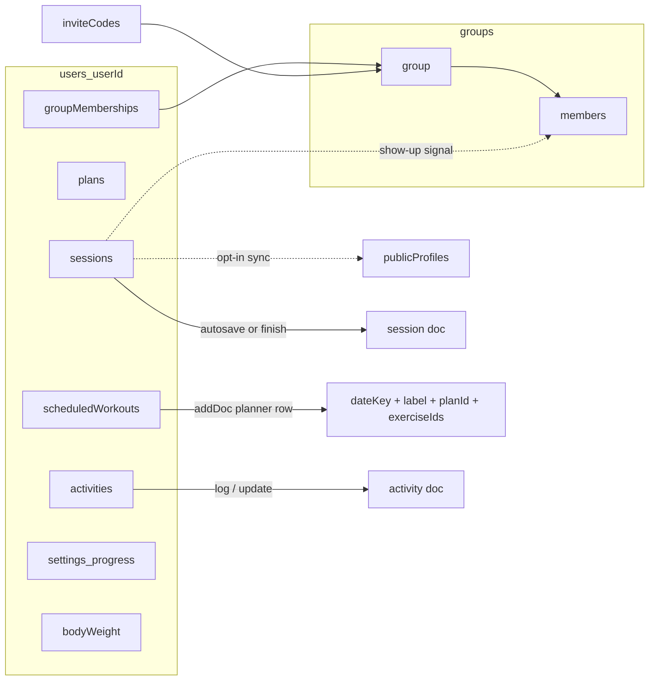

# Built Daily — data model

This document describes the domain and Firestore shapes used in the app.

**Source of truth** for TypeScript types:

| Area | Types | Persistence |
|------|--------|-------------|
| User profile | [`lib/user-profile-types.ts`](../lib/user-profile-types.ts) | [`lib/user-profile-mapper.ts`](../lib/user-profile-mapper.ts), [`lib/user-profile-repository.ts`](../lib/user-profile-repository.ts) |
| Sessions + plans | [`lib/workout-types.ts`](../lib/workout-types.ts) | [`lib/workout-session-mapper.ts`](../lib/workout-session-mapper.ts), [`lib/workout-session-repository.ts`](../lib/workout-session-repository.ts), [`lib/plan-mapper.ts`](../lib/plan-mapper.ts), [`lib/workout-plan-repository.ts`](../lib/workout-plan-repository.ts) |
| Planner | [`lib/planner-types.ts`](../lib/planner-types.ts) | [`lib/planner-repository.ts`](../lib/planner-repository.ts) |
| Activities | [`lib/activity-types.ts`](../lib/activity-types.ts) | [`lib/activity-mapper.ts`](../lib/activity-mapper.ts), [`lib/activity-repository.ts`](../lib/activity-repository.ts) |
| Progress + body weight | [`lib/progress-types.ts`](../lib/progress-types.ts) | [`lib/progress-mapper.ts`](../lib/progress-mapper.ts), [`lib/progress-settings-repository.ts`](../lib/progress-settings-repository.ts) |
| Groups | [`lib/group-types.ts`](../lib/group-types.ts) | [`lib/group-mapper.ts`](../lib/group-mapper.ts), [`lib/group-repository.ts`](../lib/group-repository.ts) |
| Public profiles | [`lib/public-profile-types.ts`](../lib/public-profile-types.ts) | [`lib/public-profile-mapper.ts`](../lib/public-profile-mapper.ts), [`lib/public-profile-repository.ts`](../lib/public-profile-repository.ts) |

Client catalogs (not Firestore collections): [`lib/exercise-catalog.ts`](../lib/exercise-catalog.ts), [`lib/activity-catalog.ts`](../lib/activity-catalog.ts), [`lib/starter-templates.ts`](../lib/starter-templates.ts).

---

## Firestore layout

All mutable **personal** user data lives under:

`users/{userId}/…`

| Path | Purpose |
|------|---------|
| `users/{userId}` | Profile: display name, timezone, units, onboarding gate |
| `users/{userId}/sessions/{sessionId}` | Workout session (`in_progress` autosave or `completed` on finish) |
| `users/{userId}/plans/{planId}` | Reusable workout templates |
| `users/{userId}/scheduledWorkouts/{entryId}` | Planner calendar rows: a **day** (`dateKey`), optional exercise list + `planId` for `/workout`, or reminder-only (`exerciseIds` empty) |
| `users/{userId}/activities/{activityId}` | Recreational / unstructured movement (walk, bike, tennis, …) — not a gym session |
| `users/{userId}/groupMemberships/{groupId}` | Reverse index of accountability groups the user belongs to |
| `users/{userId}/settings/progress` | Weekly workout goal, movement-days goal, optional goal body weight |
| `users/{userId}/bodyWeight/{entryId}` | Scale check-ins (`dateKey`, `weightLbs`) |

**Accountability groups** use top-level collections (membership-aware rules):

| Path | Purpose |
|------|---------|
| `groups/{groupId}` | Group metadata + invite code |
| `groups/{groupId}/members/{uid}` | Roster + shared “showed up” signals |
| `inviteCodes/{code}` | Join lookup by shareable code |

**Opt-in public profiles** (separate from private `users/{uid}/…`):

| Path | Purpose |
|------|---------|
| `publicProfiles/{uid}` | Display name + light consistency when `profilePublic` is true |

`users/{userId}` holds a profile document created on first sign-in (see below); everything else about a user lives in its subcollections.

Security rules: see [`firestore.rules`](../firestore.rules).



---

## User profile

Types: [`lib/user-profile-types.ts`](../lib/user-profile-types.ts). Persistence: [`lib/user-profile-repository.ts`](../lib/user-profile-repository.ts).

### `UserProfileDoc` (`users/{userId}`)

Created on first sign-in by `ensureUserProfile`, called from [`components/auth-provider.tsx`](../components/auth-provider.tsx). The same call refreshes `displayName` and `timezone` when the account or device changes.

| Field | Type | Notes |
|-------|------|--------|
| `displayName` | `string` | Auth snapshot, max 80 |
| `timezone` | `string` | IANA zone from the device, max 64; falls back to `UTC` |
| `units` | `"imperial" \| "metric"` | Preference only — all logged values are imperial today and no screen reads this yet |
| `onboardingCompletedAt` | `Date \| null` | Null until onboarding finishes; no writer yet (Phase 2) |
| `createdAt`, `updatedAt` | `Date` / `Timestamp` | |

Onboarding answers that already have a home stay there — the weekly workout goal lives in `settings/progress`, not here.

---

## Workout sessions

Types: [`lib/workout-types.ts`](../lib/workout-types.ts). Mapping: [`lib/workout-session-mapper.ts`](../lib/workout-session-mapper.ts). CRUD: [`lib/workout-session-repository.ts`](../lib/workout-session-repository.ts).

### `WorkoutSessionDoc` (`users/{userId}/sessions/{sessionId}`)

Logical shape before/after mapping (`sessionDocToFirestore` stores date fields as Firestore `Timestamp`).

| Field | Type | Notes |
|-------|------|--------|
| `status` | `"in_progress" \| "completed" \| "discarded"` | Writes use **`in_progress`** (autosave) or **`completed`** (finish). `discarded` exists in types but is not written. |
| `title` | `string` | Always stored; blank name resolves to `Workout on {date}` |
| `planId` | `string \| null` | Optional link to a plan (e.g. URL `p` param) |
| `workoutDate` | `string \| null` | Optional local calendar **`YYYY-MM-DD`** (clearable) |
| `workoutTime` | `string \| null` | Optional local **`HH:mm`** (independent of date) |
| `startedAt` | `Date` / `Timestamp` | Session screen / logical start |
| `endedAt` | `Date` / `Timestamp` \| `null` | Set on finish; **null** while `in_progress` |
| `activeDurationSec` | `number \| null` | Session timer total seconds, if greater than 0 |
| `workoutNote` | `string \| null` | Session-level note |
| `exerciseNotesByLineId` | `Record<string, string> \| null` | Keys are **`lineId`** |
| `lines` | `SessionLine[]` | Embedded lines + sets |
| `exerciseCount` | `number` | Denormalized: `lines.length` |
| `setCount` | `number` | Denormalized: total sets |
| `previewExerciseNames` | `string[]` | First few names for list UIs (max 5) |

Rules allow create + update while `status` is `completed` or `in_progress`; max 40 lines.

### `SessionLine` (embedded in `sessions`)

| Field | Type | Notes |
|-------|------|--------|
| `lineId` | `string` | Stable id for this line in the session (UUID) |
| `exerciseId` | `string` | Catalog id, or `custom-{uuid}` for user-named moves |
| `nameSnapshot` | `string` | Name at save time |
| `metric` | `ExerciseMetric` | Copied from catalog / custom default |
| `sets` | `SetLog[]` | Ordered performed sets |

**Exercise-level notes** on the session document are stored as `exerciseNotesByLineId: Record<lineId, string>` so reordering lines does not break keys.

### `SetLog` (embedded under each session line)

One object per performed set. Fields are nullable when not used / empty.

| Field | Type | Notes |
|-------|------|--------|
| `weight` | `number \| null` | `weight_reps` |
| `reps` | `number \| null` | `weight_reps`, `bodyweight_reps` |
| `durationSec` | `number \| null` | Hold / cardio seconds; `duration`, `cardio` |
| `timedSetSec` | `number \| null` | Set stopwatch (non-duration metrics) |
| `paceMph` | `number \| null` | Optional cardio pace / speed (mph) |
| `inclinePercent` | `number \| null` | Optional treadmill incline (%) |
| `resistanceLevel` | `number \| null` | Optional bike / elliptical resistance |
| `distanceMiles` | `number \| null` | Optional cardio distance (miles) |
| `note` | `string \| null` | Set-level note |

### Client finish / autosave snapshot (`ActiveWorkoutFinishSnapshot`)

Built in the active workout UI and passed into the session repository. Mapped to `WorkoutSessionDoc` by `buildWorkoutSessionDoc`.

| Field | Notes |
|-------|--------|
| `title`, `workoutDate`, `workoutTime`, `exercises`, `setsByExercise` | Mirror UI state (`workoutDate`/`workoutTime` may be empty strings) |
| `workoutNote`, `exerciseNotesByExerciseId` | UI keys exercise by **catalog `exerciseId`**; mapper copies onto **`lineId`** keys |
| `activeDurationMs` | Session timer display at finish |
| `sessionStartedAtMs` | When session screen mounted |
| `planId` | Optional |
| `lineIds` | Stable line ids parallel to `exercises` (required for updates) |

UI row shape: `UiSetRow` (`weight`, `reps`, `seconds`, `timedSetSec`, `paceMph`, `inclinePercent`, `resistanceLevel`, `distanceMiles`, `note` strings) → `SetLog` via `uiSetRowToSetLog`.

List UIs use a slim `SessionSummary` (`id`, `status`, dates, title, counts, preview names) rather than full `lines`.

---

## Workout templates (plans)

Templates live under `users/{userId}/plans/{planId}`. Home subscribes ordered by `updatedAt` descending.

### `WorkoutPlanDoc`

| Field | Type | Notes |
|-------|------|--------|
| `name` | `string` | Max 200 |
| `createdAt`, `updatedAt` | `Date` / `Timestamp` | |
| `source` | `"starter_copy" \| "custom"` | How the plan was created |
| `lines` | `PlanLine[]` | 1–40 lines |
| `restPreferences` | optional `{ autoRestTimer: boolean; defaultRestSec: 30 \| 60 \| 90 \| 120 }` | Template editor; used when starting from this plan |

Custom exercises use `exerciseId` values prefixed with `custom-` and rely on `nameSnapshot` + `metric`; the active workout URL resolver loads the saved plan when needed to rebuild `CatalogExercise` rows for those ids.

### `PlanLine`

| Field | Type | Notes |
|-------|------|--------|
| `lineId` | `string` | Stable id |
| `exerciseId` | `string` | Catalog or `custom-*` |
| `nameSnapshot` | `string` | |
| `metric` | `ExerciseMetric` | Same idea as session lines |
| `targetSets?` | `number \| null` | Planned set count |
| `notes?` | `string \| null` | Optional default note when instantiating a session |

### Starter templates (client-only)

[`lib/starter-templates.ts`](../lib/starter-templates.ts) defines library starters (`starter-full-body`, `starter-upper`, `starter-lower`, `starter-push`, `starter-pull`). They are **not** Firestore docs until the user copies one into `plans`. Planner `planId` may still be a `starter-*` id.

---

## Planner

Types: [`lib/planner-types.ts`](../lib/planner-types.ts). Owners may create, update (reschedule / mark done), and delete.

### `ScheduledWorkoutDoc` (`users/{userId}/scheduledWorkouts/{entryId}`)

| Field | Type | Notes |
|-------|------|--------|
| `dateKey` | `string` | Local calendar `YYYY-MM-DD`; changing it reschedules the entry |
| `label` | `string` | Non-empty, max 200 |
| `planId` | `string \| null` | Firestore plan id, starter id (`starter-*`), or null for reminder-only |
| `exerciseIds` | `string[]` | For `/workout` `e` param; empty array when note-only (max 40) |
| `status` | `"planned" \| "completed" \| "skipped"` | Docs written before this field read as `planned` |
| `sessionId` | `string \| null` | Session that completed the entry; rules only allow non-null when `status` is `completed` |
| `createdAt` | `Timestamp` | `serverTimestamp()` on create; immutable on update |

`ScheduledWorkoutEntry` is the same shape plus Firestore `id`. Updates go through `updateScheduledWorkout`, which always writes `status` and `sessionId` together so the pair stays consistent.

---

## Activities

Recreational / unstructured movement, distinct from gym sessions. Types: [`lib/activity-types.ts`](../lib/activity-types.ts).

### `ActivityDoc` (`users/{userId}/activities/{activityId}`)

| Field | Type | Notes |
|-------|------|--------|
| `activityTypeId` | `string` | Catalog id (`walk`, `bike`, `tennis`, …); max 64 |
| `activityDate` | `string` | Local calendar `YYYY-MM-DD` |
| `activityTime` | `string \| null` | Local `HH:mm`, optional |
| `durationMin` | `number \| null` | Whole minutes, 1–1440 |
| `distanceMiles` | `number \| null` | Only when the catalog type `supportsDistance`; 0–500 |
| `locationName` | `string \| null` | Max 120 |
| `notes` | `string \| null` | Max 400 |
| `visibility` | `"private"` | Only value today |
| `source` | `"manual"` | Only value today |
| `startedAt` | `Date \| null` | Reserved; current logs store null |
| `endedAt` | `Date \| null` | Reserved; current logs store null |
| `createdAt` | `Date` / `Timestamp` | |
| `updatedAt` | `Date` / `Timestamp` | |

`SavedActivity` is `{ id, activity }`. Create input is `LogActivityInput` (type, date, optional time / duration / distance / location / notes).

---

## Progress settings and body weight

Types: [`lib/progress-types.ts`](../lib/progress-types.ts).

### `ProgressSettingsDoc` (`users/{userId}/settings/progress`)

Single document id `progress`. Defaults if missing: weekly goal **3**, movement days **5**, no goal weight.

| Field | Type | Notes |
|-------|------|--------|
| `weeklyGoal` | `2 \| 3 \| 4 \| 5 \| 6 \| 7` | Completed **workouts** per Mon–Sun week |
| `movementGoalDays` | `3 \| 4 \| 5 \| 6 \| 7` | Active **days** (workout or activity counts). Optional on older docs; client defaults to 5 |
| `goalWeightLbs` | `number \| null` | Optional target; 0–1000 when set |
| `updatedAt` | `Date` / `Timestamp` | |

### `BodyWeightEntryDoc` (`users/{userId}/bodyWeight/{entryId}`)

| Field | Type | Notes |
|-------|------|--------|
| `dateKey` | `string` | Local `YYYY-MM-DD` |
| `weightLbs` | `number` | Positive, ≤ 1000; stored to one decimal |
| `createdAt` | `Date` / `Timestamp` | |

`SavedBodyWeightEntry` is `{ id, entry }`. Multiple entries per day are allowed (append-only create; owner may update/delete).

---

## Accountability groups

Types: [`lib/group-types.ts`](../lib/group-types.ts). Limits: name 100, display name 80, invite code 8 chars (rules allow up to 12), max 12 members, max 20 groups per user.

Partners only see show-up signals (today / last date / streak)—never workout details.

### `AccountabilityGroupDoc` (`groups/{groupId}`)

| Field | Type | Notes |
|-------|------|--------|
| `name` | `string` | Max 100 |
| `createdBy` | `string` | Owner uid |
| `createdAt` | `Timestamp` | |
| `inviteCode` | `string` | Current active code |
| `memberCount` | `number` | Max 12 |

### `GroupMemberDoc` (`groups/{groupId}/members/{uid}`)

| Field | Type | Notes |
|-------|------|--------|
| `uid` | `string` | Same as doc id |
| `displayName` | `string` | Auth snapshot, max 80 |
| `role` | `"owner" \| "member"` | |
| `joinedAt` | `Timestamp` | |
| `lastWorkoutDateKey` | `string \| null` | Local `YYYY-MM-DD` |
| `lastWorkoutAt` | `Timestamp \| null` | |
| `currentStreak` | `number` | Consecutive local days with a completed workout |
| `weeklyGoal` | `2 \| 3 \| 4 \| 5 \| 6 \| 7` | Copy of the member's private `settings/progress.weeklyGoal` so the roster can show progress without reading another user's private data |

`weeklyGoal` is kept in sync by `syncWeeklyGoalToGroups` when the setting changes, and re-written on each workout finish by `bumpGroupWorkoutSignals`.

`lastWorkoutDateKey`, `lastWorkoutAt`, and `currentStreak` are **recomputed from the user's sessions**, not incremented — see [Show-up signals](#show-up-signals-shared-computation) below. Rules still let the owner write these fields directly (`validMemberSelfSignalUpdate`), so a stale client write is possible; nothing server-side rejects it yet (tracked in #6, deferred pending a Cloud Function trigger).

### `InviteCodeDoc` (`inviteCodes/{code}`)

| Field | Type | Notes |
|-------|------|--------|
| `groupId` | `string` | |
| `createdBy` | `string` | |
| `createdAt` | `Timestamp` | |
| `active` | `boolean` | Rotated codes set `active: false` |

### `GroupMembershipIndexDoc` (`users/{userId}/groupMemberships/{groupId}`)

Reverse index so the owner can list their groups without scanning `groups`.

| Field | Type | Notes |
|-------|------|--------|
| `groupId` | `string` | Same as doc id |
| `nameSnapshot` | `string` | Group name at join / last sync, max 100 |
| `role` | `"owner" \| "member"` | |
| `joinedAt` | `Timestamp` | |

---

## Public profiles

Types: [`lib/public-profile-types.ts`](../lib/public-profile-types.ts). Persistence: [`lib/public-profile-repository.ts`](../lib/public-profile-repository.ts).

### `PublicProfileDoc` (`publicProfiles/{uid}`)

Opt-in shareable slice. Default is private (`profilePublic: false` or missing doc). Does **not** expose sessions, body weight, plans, activities, or email.

| Field | Type | Notes |
|-------|------|--------|
| `displayName` | `string` | Auth snapshot, max 80 |
| `profilePublic` | `boolean` | Public read only when `true` |
| `currentStreak` | `number` | Consecutive local days with a workout |
| `workoutsThisWeek` | `number` | Completed sessions in the Mon–Sun week of last workout |
| `lastWorkoutDateKey` | `string \| null` | Local `YYYY-MM-DD` |
| `activityByDay` | `map` | Sparse `YYYY-MM-DD` → **workout** count for the consistency chart (max 200 keys, ~26 weeks) |
| `updatedAt` | `Timestamp` | |

Public page: `/u/[userId]`. Owner toggles in Settings. Chart shows workout days only—no session titles, PRs, activities, or body weight.

---

## Show-up signals (shared computation)

`currentStreak`, `workoutsThisWeek`, `lastWorkoutDateKey`, `lastWorkoutAt`, and `activityByDay` — on both `GroupMemberDoc` and `PublicProfileDoc` — are **recomputed from the user's completed sessions on every write**, not incremented. Recomputing means a deleted, moved, reopened, or backdated session self-heals the next time signals are synced, instead of leaving stale drift behind (the old increment-based approach could not do this).

The compute logic is a single pure function, [`lib/workout-signals.ts`](../lib/workout-signals.ts) (`computeWorkoutSignals`), fed by two thin fetch wrappers so both the browser and server-side code stay correct the same way:

| Caller | Fetch wrapper | Writes to |
|--------|---------------|-----------|
| Web app (finish, edit, reopen, delete a session) | [`lib/workout-signals-client.ts`](../lib/workout-signals-client.ts) (client SDK) | `lib/group-repository.ts` (`bumpGroupWorkoutSignals`), `lib/public-profile-repository.ts` (`syncPublicProfileConsistency`) |
| MCP server (create/update a completed session) | [`lib/workout-signals-admin.ts`](../lib/workout-signals-admin.ts) (Admin SDK) | `syncWorkoutSignalsForUser`, which writes both group members and the public profile itself |

This is the **shared server function** approach (not a Cloud Function trigger — see #6/#10 on GitHub and the Notion Onboarding Readiness page for the tradeoff): no new infra, stays on the Firebase Spark (free) plan, but every write path that can complete/uncomplete a session still has to remember to call the sync. Known call sites are listed above; a Cloud Function trigger that can't be forgotten is tracked as a follow-up once usage grows past a couple of testers.

---

## Exercise catalog (client)

Defined in [`lib/exercise-catalog.ts`](../lib/exercise-catalog.ts). Not stored in Firestore as a collection; sessions and plans store **`exerciseId`** plus a **`nameSnapshot`** on each line so history stays readable if catalog copy changes.

Muscle tags live on the catalog, not on persisted session lines. [`lib/exercise-muscle.ts`](../lib/exercise-muscle.ts) resolves a group from catalog `primary`, then name hints, else `"other"`.

### `ExerciseMetric`

| Value | Meaning |
|-------|---------|
| `weight_reps` | Weight + reps |
| `bodyweight_reps` | Reps only |
| `duration` | Hold time (seconds) |
| `cardio` | Duration plus optional pace / incline / resistance / distance |

### `CatalogExercise`

| Field | Type | Notes |
|-------|------|--------|
| `id` | `string` | Stable id, safe in URL lists (no commas) |
| `name` | `string` | Display name |
| `metric` | `ExerciseMetric` | Drives set UI and how `SetLog` is filled |
| `primary?` | `MuscleGroup` | Main muscle group; omitted on custom exercises |
| `secondary?` | `MuscleGroup[]` | Helper groups |

### `MuscleGroup`

From [`lib/progress-types.ts`](../lib/progress-types.ts): `"chest" | "back" | "shoulders" | "arms" | "legs" | "core" | "cardio" | "other"`.

`MuscleFocus` (diagram picker, not persisted): `"full" | "torso" | "back" | "arms" | "legs" | "core"`.

---

## Activity catalog (client)

Defined in [`lib/activity-catalog.ts`](../lib/activity-catalog.ts). Logged activities store **`activityTypeId`** only; display name/icon come from this catalog.

### `ActivityCatalogEntry`

| Field | Type | Notes |
|-------|------|--------|
| `id` | `string` | e.g. `walk`, `dog-walk`, `bike`, `hike`, `swim`, `tennis`, `pickleball`, `basketball`, `skate`, `dance`, `play`, `other` |
| `name` | `string` | Display name |
| `icon` | Lucide name union | Log UI |
| `supportsDistance` | `boolean` | Whether `distanceMiles` is accepted |
| `isSocial` | `boolean` | Hint for future pickup / social features |

---

## String limits

### Workout notes (`NOTE_LIMITS`)

From [`lib/workout-types.ts`](../lib/workout-types.ts). Used when trimming UI input before persist.

| Key | Max length |
|-----|--------------|
| `workoutNote` | 500 |
| `exerciseNote` | 400 |
| `setNote` | 200 |
| `title` | 200 |

### Activity limits

From [`lib/activity-types.ts`](../lib/activity-types.ts).

| Key | Max length |
|-----|--------------|
| `notes` | 400 |
| `locationName` | 120 |

---

## Client-derived (not persisted)

Computed in [`lib/progress-insights.ts`](../lib/progress-insights.ts), [`lib/movement-insights.ts`](../lib/movement-insights.ts), and related UI. Types live in [`lib/progress-types.ts`](../lib/progress-types.ts).

| Type | Meaning |
|------|---------|
| `PersonalRecord` | Best estimated 1RM per exercise from completed sessions (`exerciseId`, weight, reps, `estimated1Rm`, `dateKey`, `sessionId`, `isNewPr`) |
| `DayWorkoutSummary` | One session on a calendar day (title, duration, volume, PRs) |
| `DayLoggedActivitySummary` | One recreational activity that day |
| `DayActivityDetail` | Combined workouts + activities for a heatmap day |
| `WeekGoalStatus` | Weekly workout goal vs completed count |
| `Milestone` | Consistency badges (`id`, title, `achievedAtKey`) |

These are rebuilt from sessions, activities, and settings — they are not Firestore documents.

---

## Queries and indexes

- **Recent sessions** (typical): `users/{uid}/sessions` where `status` in `completed` / `in_progress`, order by `endedAt` desc (in-progress rows sort to the top in the client).
- **Plans**: `users/{uid}/plans` order by `updatedAt` desc.
- **Planner year window**: `users/{uid}/scheduledWorkouts` where `dateKey` between `YYYY-01-01` and `YYYY-12-31` (client subscribes per visible year).
- **Recent activities**: `users/{uid}/activities` order by `activityDate` desc.
- **Activities by type** (suggestions): `activityTypeId` == id, order by `activityDate` desc.
- **Body weight**: `users/{uid}/bodyWeight` order by `dateKey` asc.

Composite indexes: [`firestore.indexes.json`](../firestore.indexes.json)

- `sessions`: `status` ASC, `endedAt` DESC
- `activities`: `activityTypeId` ASC, `activityDate` DESC

---

## Related files

| File | Role |
|------|------|
| [`lib/user-profile-types.ts`](../lib/user-profile-types.ts) | `UserProfileDoc` + limits |
| [`lib/user-profile-mapper.ts`](../lib/user-profile-mapper.ts) | Profile Firestore mapping + device timezone |
| [`lib/user-profile-repository.ts`](../lib/user-profile-repository.ts) | `ensureUserProfile` on sign-in |
| [`lib/workout-types.ts`](../lib/workout-types.ts) | Session / plan domain types + `NOTE_LIMITS` |
| [`lib/workout-session-mapper.ts`](../lib/workout-session-mapper.ts) | `buildWorkoutSessionDoc`, `sessionDocToFirestore`, `ActiveWorkoutFinishSnapshot` |
| [`lib/workout-session-repository.ts`](../lib/workout-session-repository.ts) | Session subscribe / create / update / delete |
| [`lib/plan-mapper.ts`](../lib/plan-mapper.ts) | `workoutPlanDocToFirestore` / `firestoreToWorkoutPlanDoc` |
| [`lib/workout-plan-repository.ts`](../lib/workout-plan-repository.ts) | Plan `onSnapshot`, create / update / delete |
| [`lib/planner-types.ts`](../lib/planner-types.ts) | `ScheduledWorkoutDoc` / `ScheduledWorkoutEntry` |
| [`lib/planner-repository.ts`](../lib/planner-repository.ts) | Subscribe, add, update, and delete `scheduledWorkouts` |
| [`lib/activity-types.ts`](../lib/activity-types.ts) | `ActivityDoc`, log input, activity string limits |
| [`lib/activity-mapper.ts`](../lib/activity-mapper.ts) | Activity Firestore mapping + `buildActivityDoc` |
| [`lib/activity-repository.ts`](../lib/activity-repository.ts) | Activity subscribe / log / update / delete |
| [`lib/activity-catalog.ts`](../lib/activity-catalog.ts) | Static activity types |
| [`lib/progress-types.ts`](../lib/progress-types.ts) | Settings, body weight, muscle groups, insight types |
| [`lib/progress-mapper.ts`](../lib/progress-mapper.ts) | Settings + body-weight Firestore mapping |
| [`lib/progress-settings-repository.ts`](../lib/progress-settings-repository.ts) | Settings + body-weight subscribe / write |
| [`lib/group-types.ts`](../lib/group-types.ts) | Group, member, invite, membership index |
| [`lib/group-mapper.ts`](../lib/group-mapper.ts) | Group Firestore mapping + invite codes |
| [`lib/group-repository.ts`](../lib/group-repository.ts) | Group CRUD, join/leave, show-up signals |
| [`lib/public-profile-types.ts`](../lib/public-profile-types.ts) | Opt-in public profile |
| [`lib/public-profile-mapper.ts`](../lib/public-profile-mapper.ts) | Public profile Firestore mapping |
| [`lib/public-profile-repository.ts`](../lib/public-profile-repository.ts) | Public profile read / write / consistency sync |
| [`lib/workout-signals.ts`](../lib/workout-signals.ts) | Pure show-up signal computation, shared by group + public profile |
| [`lib/workout-signals-client.ts`](../lib/workout-signals-client.ts) | Client-SDK fetch wrapper (web app) |
| [`lib/workout-signals-admin.ts`](../lib/workout-signals-admin.ts) | Admin-SDK fetch + write wrapper (MCP server) |
| [`lib/workout-activity.ts`](../lib/workout-activity.ts) | `WorkoutActivityByDay`, streak/heatmap helpers, `activityByDay` Map↔Record + prune |
| [`lib/exercise-catalog.ts`](../lib/exercise-catalog.ts) | Static exercises + metrics |
| [`lib/exercise-muscle.ts`](../lib/exercise-muscle.ts) | Muscle group resolution + focus picker |
| [`lib/starter-templates.ts`](../lib/starter-templates.ts) | Client starter plan ids |
| [`lib/workout-date.ts`](../lib/workout-date.ts) | `YYYY-MM-DD` / `HH:mm` helpers |
| [`lib/firebase.ts`](../lib/firebase.ts) | Lazy Firebase app / Auth / Firestore |
| [`firestore.rules`](../firestore.rules) | Owner rules + create/update validation |
| [`firestore.indexes.json`](../firestore.indexes.json) | Composite indexes |
| [`firebase.json`](../firebase.json) | Rules + indexes paths for CLI |
| [`scripts/export-all-data.ts`](../scripts/export-all-data.ts) | Admin-SDK backup of every user's data before a migration |
| [`scripts/backfill-phase-1.ts`](../scripts/backfill-phase-1.ts) | Migrates existing docs to the profile / planner status / `weeklyGoal` shapes |
| [`.firebaserc`](../.firebaserc) | Default Firebase project id for `firebase deploy` |

---

## dbdiagram (DBML)

Paste into [dbdiagram.io](https://dbdiagram.io). Firestore is document-based (no joins); this is a **conceptual** relational view of the same shapes.

Nested arrays (`lines`, `sets`) are drawn as child tables even though they are **embedded** in the parent document. Client catalogs have no Firestore collection. `scheduledWorkouts.planId` may be a `starter-*` id that is not a `plans` document.

```dbml
//// Built Daily — conceptual ER (Firestore as tables)
//// https://dbdiagram.io

TableGroup personal {
  sessions
  session_lines
  set_logs
  plans
  plan_lines
  scheduled_workouts
  activities
  progress_settings
  body_weight
  group_memberships
}

TableGroup groups_top_level {
  groups
  group_members
  invite_codes
}

TableGroup public_opt_in {
  public_profiles
}

TableGroup client_catalogs [note: 'Not stored in Firestore'] {
  catalog_exercises
  catalog_activity_types
}

Table users {
  userId string [pk, note: 'Firebase Auth uid']
  displayName string [not null, note: 'max 80']
  timezone string [not null, note: 'IANA zone, max 64']
  units string [not null, note: 'imperial | metric (preference only)']
  onboardingCompletedAt timestamp [note: 'null until onboarding finishes']
  createdAt timestamp [not null]
  updatedAt timestamp [not null]

  Note: 'users/{userId} — created on first sign-in'
}

Table sessions {
  sessionId string [pk]
  userId string [not null]
  status string [not null, note: 'in_progress | completed (discarded unused)']
  title string [not null, note: 'max 200']
  planId string [note: 'optional Firestore plan or starter-*']
  workoutDate string [note: 'YYYY-MM-DD, optional']
  workoutTime string [note: 'HH:mm, optional']
  startedAt timestamp [not null]
  endedAt timestamp [note: 'null while in_progress']
  activeDurationSec int
  workoutNote string [note: 'max 500']
  exerciseNotesByLineId json [note: 'map lineId → note']
  exerciseCount int [not null]
  setCount int [not null]
  previewExerciseNames json [note: 'string[], max 5']

  indexes {
    (status, endedAt) [name: 'recent completed / in_progress']
  }

  Note: 'users/{userId}/sessions/{sessionId}'
}

Table session_lines {
  lineId string [pk]
  sessionId string [not null]
  exerciseId string [not null, note: 'catalog id or custom-{uuid}']
  nameSnapshot string [not null]
  metric string [not null, note: 'weight_reps | bodyweight_reps | duration | cardio']

  Note: 'Embedded in sessions.lines[]'
}

Table set_logs {
  setIndex int [pk, increment]
  lineId string [not null]
  weight float
  reps int
  durationSec int
  timedSetSec int
  paceMph float
  inclinePercent float
  resistanceLevel float
  distanceMiles float
  note string [note: 'max 200']

  Note: 'Embedded in session_lines.sets[]'
}

Table plans {
  planId string [pk]
  userId string [not null]
  name string [not null, note: 'max 200']
  createdAt timestamp [not null]
  updatedAt timestamp [not null]
  source string [not null, note: 'starter_copy | custom']
  restPreferences json [note: '{ autoRestTimer, defaultRestSec: 30|60|90|120 }']

  Note: 'users/{userId}/plans/{planId}'
}

Table plan_lines {
  lineId string [pk]
  planId string [not null]
  exerciseId string [not null, note: 'catalog id or custom-{uuid}']
  nameSnapshot string [not null]
  metric string [not null]
  targetSets int
  notes string

  Note: 'Embedded in plans.lines[] (1–40)'
}

Table scheduled_workouts {
  entryId string [pk]
  userId string [not null]
  dateKey string [not null, note: 'YYYY-MM-DD']
  label string [not null, note: 'max 200']
  planId string [note: 'plan id, starter-*, or null']
  exerciseIds json [not null, note: 'string[], empty if reminder-only']
  status string [not null, note: 'planned | completed | skipped']
  sessionId string [note: 'set only when status is completed']
  createdAt timestamp [not null, note: 'immutable on update']

  Note: 'users/{userId}/scheduledWorkouts/{entryId}'
}

Table activities {
  activityId string [pk]
  userId string [not null]
  activityTypeId string [not null, note: 'catalog id, max 64']
  activityDate string [not null, note: 'YYYY-MM-DD']
  activityTime string [note: 'HH:mm']
  durationMin int [note: '1–1440']
  distanceMiles float [note: 'when catalog supportsDistance']
  locationName string [note: 'max 120']
  notes string [note: 'max 400']
  visibility string [not null, note: 'private']
  source string [not null, note: 'manual']
  startedAt timestamp [note: 'reserved, currently null']
  endedAt timestamp [note: 'reserved, currently null']
  createdAt timestamp [not null]
  updatedAt timestamp [not null]

  indexes {
    (activityTypeId, activityDate) [name: 'suggestions by type']
  }

  Note: 'users/{userId}/activities/{activityId}'
}

Table progress_settings {
  userId string [pk]
  weeklyGoal int [not null, note: '2–7 workouts / week']
  movementGoalDays int [note: '3–7 active days; default 5']
  goalWeightLbs float [note: 'optional, ≤ 1000']
  updatedAt timestamp [not null]

  Note: 'users/{userId}/settings/progress (singleton)'
}

Table body_weight {
  entryId string [pk]
  userId string [not null]
  dateKey string [not null, note: 'YYYY-MM-DD']
  weightLbs float [not null]
  createdAt timestamp [not null]

  Note: 'users/{userId}/bodyWeight/{entryId}'
}

Table group_memberships {
  groupId string [pk]
  userId string [not null]
  nameSnapshot string [not null, note: 'group name, max 100']
  role string [not null, note: 'owner | member']
  joinedAt timestamp [not null]

  Note: 'users/{userId}/groupMemberships/{groupId}'
}

Table groups {
  groupId string [pk]
  name string [not null, note: 'max 100']
  createdBy string [not null, note: 'owner uid']
  createdAt timestamp [not null]
  inviteCode string [not null]
  memberCount int [not null, note: 'max 12']

  Note: 'groups/{groupId}'
}

Table group_members {
  uid string [pk]
  groupId string [not null]
  displayName string [not null, note: 'max 80']
  role string [not null, note: 'owner | member']
  joinedAt timestamp [not null]
  lastWorkoutDateKey string [note: 'YYYY-MM-DD']
  lastWorkoutAt timestamp
  currentStreak int [not null]
  weeklyGoal int [not null, note: '2–7; copy of the member settings/progress goal']

  Note: 'groups/{groupId}/members/{uid} — show-up signals only'
}

Table invite_codes {
  code string [pk]
  groupId string [not null]
  createdBy string [not null]
  createdAt timestamp [not null]
  active boolean [not null, note: 'false after rotation']

  Note: 'inviteCodes/{code}'
}

Table public_profiles {
  userId string [pk]
  displayName string [not null, note: 'max 80']
  profilePublic boolean [not null]
  currentStreak int [not null]
  workoutsThisWeek int [not null]
  lastWorkoutDateKey string [note: 'YYYY-MM-DD']
  activityByDay json [not null, note: 'YYYY-MM-DD → workout count, max 200']
  updatedAt timestamp [not null]

  Note: 'publicProfiles/{uid} — opt-in; no session details'
}

Table catalog_exercises {
  id string [pk]
  name string [not null]
  metric string [not null]
  primary string [note: 'MuscleGroup']
  secondary json [note: 'MuscleGroup[]']

  Note: 'lib/exercise-catalog.ts — client only'
}

Table catalog_activity_types {
  id string [pk]
  name string [not null]
  icon string
  supportsDistance boolean [not null]
  isSocial boolean [not null]

  Note: 'lib/activity-catalog.ts — client only'
}

Ref: sessions.userId > users.userId
Ref: sessions.planId > plans.planId
Ref: session_lines.sessionId > sessions.sessionId
Ref: set_logs.lineId > session_lines.lineId
Ref: plans.userId > users.userId
Ref: plan_lines.planId > plans.planId
Ref: scheduled_workouts.userId > users.userId
Ref: activities.userId > users.userId
Ref: progress_settings.userId - users.userId
Ref: body_weight.userId > users.userId
Ref: group_memberships.userId > users.userId
Ref: group_memberships.groupId > groups.groupId
Ref: groups.createdBy > users.userId
Ref: group_members.groupId > groups.groupId
Ref: group_members.uid > users.userId
Ref: invite_codes.groupId > groups.groupId
Ref: public_profiles.userId - users.userId
Ref: session_lines.exerciseId > catalog_exercises.id
Ref: plan_lines.exerciseId > catalog_exercises.id
Ref: activities.activityTypeId > catalog_activity_types.id
```

When you change persisted fields, update **this doc**, the matching **types** file, the **mapper**, **`firestore.rules`**, and **`firestore.indexes.json`** if new queries need indexes. Push rules and indexes to Firebase with `firebase deploy --only firestore` after `firebase login` (uses the default project in `.firebaserc`).

