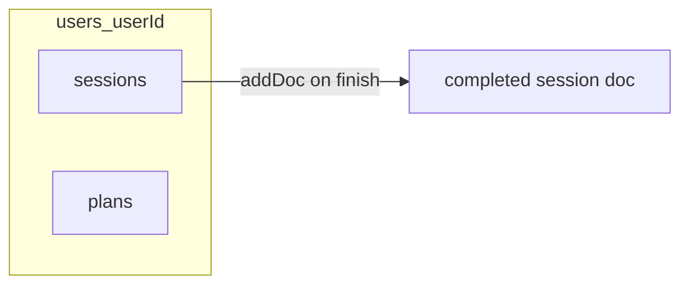

# Built Daily — data model

This document describes the domain and Firestore shapes used in the app. **Source of truth** for TypeScript types is [`lib/workout-types.ts`](lib/workout-types.ts); persistence mapping lives in [`lib/workout-session-mapper.ts`](lib/workout-session-mapper.ts) and [`lib/workout-session-repository.ts`](lib/workout-session-repository.ts).

---

## Firestore layout

All mutable user data lives under:

`users/{userId}/…`

| Path | Purpose |
|------|---------|
| `users/{userId}/sessions/{sessionId}` | One workout session (currently **completed** writes on finish) |
| `users/{userId}/plans/{planId}` | Reusable workout templates (CRUD via [`lib/workout-plan-repository.ts`](../lib/workout-plan-repository.ts)) |
| `users/{userId}/scheduledWorkouts/{entryId}` | Planner entries: a **calendar day** (`dateKey`), optional **exercise list** + `planId` for starting `/workout`, or **reminder-only** (`exerciseIds` empty) — see [`lib/planner-repository.ts`](../lib/planner-repository.ts) |

Security rules: see [`firestore.rules`](firestore.rules) (owner-only; session **create** has structural validation).

---

## Exercise catalog (client / Phase 1)

Defined in [`lib/exercise-catalog.ts`](lib/exercise-catalog.ts). Not stored in Firestore as a collection today; sessions store **`exerciseId`** plus a **`nameSnapshot`** on each line so history stays readable if catalog copy changes.

### `ExerciseMetric`

| Value | Meaning |
|-------|---------|
| `weight_reps` | Weight + reps |
| `bodyweight_reps` | Reps only |
| `duration` | Hold time (seconds) |

### `CatalogExercise` (conceptual)

| Field | Type | Notes |
|-------|------|--------|
| `id` | `string` | Stable id, safe in URL lists (no commas) |
| `name` | `string` | Display name |
| `metric` | `ExerciseMetric` | Drives set UI and how `SetLog` is filled |

---

## String limits (`NOTE_LIMITS`)

From [`lib/workout-types.ts`](lib/workout-types.ts). Used when trimming UI input before persist.

| Key | Max length |
|-----|--------------|
| `workoutNote` | 500 |
| `exerciseNote` | 400 |
| `setNote` | 200 |
| `title` | 200 |

---

## `SetLog` (embedded under each session line)

One object per performed set. Fields are nullable when not used / empty.

| Field | Type | Notes |
|-------|------|--------|
| `weight` | `number \| null` | `weight_reps` |
| `reps` | `number \| null` | `weight_reps`, `bodyweight_reps` |
| `durationSec` | `number \| null` | Hold seconds; `duration` |
| `timedSetSec` | `number \| null` | Set stopwatch (non-duration metrics) |
| `note` | `string \| null` | Set-level note |

---

## `SessionLine` (embedded in `sessions`)

| Field | Type | Notes |
|-------|------|--------|
| `lineId` | `string` | Stable id for this line in the session (UUID) |
| `exerciseId` | `string` | Catalog (or future user) id |
| `nameSnapshot` | `string` | Name at save time |
| `metric` | `ExerciseMetric` | Copied from catalog |
| `sets` | `SetLog[]` | Ordered performed sets |

**Exercise-level notes** on the session document are stored as `exerciseNotesByLineId: Record<lineId, string>` so reordering lines does not break keys.

---

## `WorkoutSessionDoc`

Logical shape before/after mapping (see `sessionDocToFirestore` for `Timestamp` fields in Firestore).

| Field | Type | Notes |
|-------|------|--------|
| `status` | `"in_progress" \| "completed" \| "discarded"` | Current writes use **`completed`** |
| `title` | `string` | Session title |
| `planId` | `string \| null` | Optional link to a plan (e.g. from URL `p` param) |
| `workoutDate` | `string` | Local calendar **`YYYY-MM-DD`** at finish (see [`lib/workout-date.ts`](lib/workout-date.ts)) |
| `startedAt` | `Date` / `Timestamp` | Session screen / logical start |
| `endedAt` | `Date` / `Timestamp` | When user finished |
| `activeDurationSec` | `number \| null` | Session timer total seconds, if greater than 0 |
| `workoutNote` | `string \| null` | Session-level note |
| `exerciseNotesByLineId` | `Record<string, string> \| null` | Keys are **`lineId`** |
| `lines` | `SessionLine[]` | Embedded lines + sets |
| `exerciseCount` | `number` | Denormalized: `lines.length` |
| `setCount` | `number` | Denormalized: total sets |
| `previewExerciseNames` | `string[]` | First few names for list UIs |

---

## Client finish snapshot (`ActiveWorkoutFinishSnapshot`)

Built in the active workout UI and passed into [`saveCompletedWorkoutSession`](lib/workout-session-repository.ts). Mapped to `WorkoutSessionDoc` by `buildWorkoutSessionDoc`.

| Field | Notes |
|-------|--------|
| `title`, `exercises`, `setsByExercise` | Mirror UI state |
| `workoutNote`, `exerciseNotesByExerciseId` | UI keys exercise by **catalog `exerciseId`**; mapper copies onto **`lineId`** keys |
| `activeDurationMs` | Session timer display at finish |
| `sessionStartedAtMs` | When session screen mounted |
| `planId` | Optional |

UI row shape: `UiSetRow` (`weight`, `reps`, `seconds`, `timedSetSec`, `note` strings) → `SetLog` via `uiSetRowToSetLog`.

---

## `WorkoutPlanDoc` / `PlanLine` (planned templates)

Templates live under `users/{userId}/plans/{planId}`. The app maps Firestore payloads with [`lib/plan-mapper.ts`](../lib/plan-mapper.ts) and reads/writes through [`lib/workout-plan-repository.ts`](../lib/workout-plan-repository.ts). The home screen subscribes to plans ordered by `updatedAt` descending.

### `WorkoutPlanDoc`

| Field | Type |
|-------|------|
| `name` | `string` |
| `createdAt`, `updatedAt` | `Date` |
| `source` | `"starter_copy" \| "custom"` |
| `lines` | `PlanLine[]` |
| `restPreferences` | optional `{ autoRestTimer: boolean; defaultRestSec: 30 \| 60 \| 90 \| 120 }` — used by the template editor; live workout wiring can follow |

Custom exercises use `exerciseId` values prefixed with `custom-` and rely on `nameSnapshot` + `metric`; the active workout URL resolver loads the saved plan when needed to rebuild `CatalogExercise` rows for those ids.

### `PlanLine`

| Field | Type |
|-------|------|
| `lineId`, `exerciseId`, `nameSnapshot`, `metric` | Same idea as session lines |
| `targetSets?` | `number \| null` |
| `notes?` | `string \| null` |

---

## Queries and indexes

- **Recent completed sessions** (typical): `users/{uid}/sessions` where `status == "completed"` order by `endedAt` desc.
- **Planner year window**: `users/{uid}/scheduledWorkouts` where `dateKey` between `YYYY-01-01` and `YYYY-12-31` (client subscribes per visible year).
- Composite index: [`firestore.indexes.json`](firestore.indexes.json) — `sessions`: `status` ASC, `endedAt` DESC (collection group id `sessions`).

---

## Related files

| File | Role |
|------|------|
| [`lib/workout-types.ts`](lib/workout-types.ts) | Domain types + `NOTE_LIMITS` |
| [`lib/workout-session-mapper.ts`](lib/workout-session-mapper.ts) | `buildWorkoutSessionDoc`, `sessionDocToFirestore`, `ActiveWorkoutFinishSnapshot` |
| [`lib/workout-session-repository.ts`](lib/workout-session-repository.ts) | `addDoc` to `users/{uid}/sessions` |
| [`lib/plan-mapper.ts`](lib/plan-mapper.ts) | `workoutPlanDocToFirestore` / `firestoreToWorkoutPlanDoc` |
| [`lib/workout-plan-repository.ts`](lib/workout-plan-repository.ts) | Plan `onSnapshot`, `createWorkoutPlan`, `updateWorkoutPlan`, `deleteWorkoutPlan` |
| [`lib/workout-date.ts`](lib/workout-date.ts) | `workoutDate` (`YYYY-MM-DD`) and header formatting |
| [`lib/firebase.ts`](lib/firebase.ts) | Lazy Firebase app / Auth / Firestore |
| [`firestore.rules`](firestore.rules) | Owner rules + session create validation |
| [`firebase.json`](firebase.json) | Rules + indexes paths for CLI |

When you change persisted fields, update **this doc**, **`workout-types`**, the **mapper**, **`firestore.rules`** (`validWorkoutSessionCreate` for sessions; plan document checks under `plans/{planId}`), and **`firestore.indexes.json`** if new queries need indexes.
